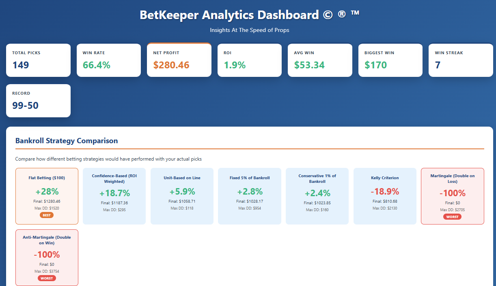
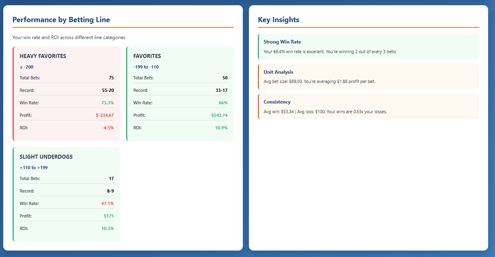
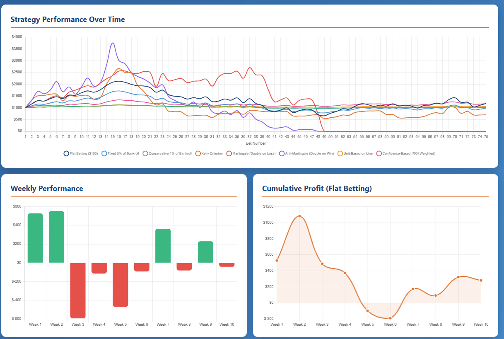
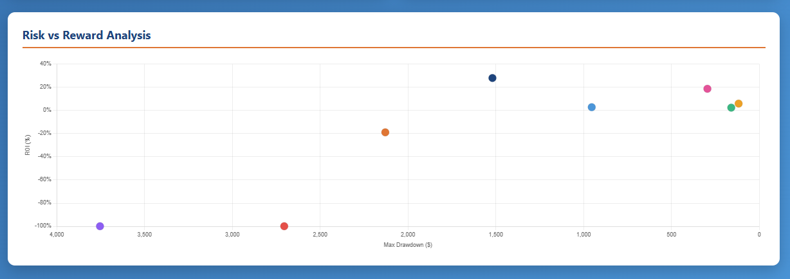

# BetKeeper

**Analytics Dashboard for ESPN Fantasy Betting**

BetKeeper is a Python-based analytics tool that fetches your ESPN fantasy betting picks and generates comprehensive visualizations and insights to help you understand your betting performance and optimize your strategy.


## Screenshots


*Main dashboard showing overall statistics and bankroll strategy comparison*


*Performance by betting line and key insights*


*Strategy performance over time and weekly breakdown*


*Risk versus reward analysis across all strategies*

## Features

### Comprehensive Analytics
- **Overall Performance Metrics**: Win rate, ROI, total profit and loss, and record tracking
- **Weekly Breakdown**: Track performance week-by-week throughout the season
- **Betting Line Analysis**: Performance across different odds categories (heavy favorites, favorites, slight underdogs, big underdogs)
- **Streak Tracking**: Monitor winning and losing streaks over time

### Bankroll Strategy Simulator
Compare 8 different betting strategies using your actual picks:
- **Flat Betting**: Consistent $100 bets every time
- **Fixed Percentage**: 5% of current bankroll
- **Conservative Percentage**: 1% of current bankroll
- **Kelly Criterion**: Mathematically optimal bet sizing
- **Martingale**: Double bet after each loss
- **Anti-Martingale**: Double bet after each win
- **Unit-Based**: Adjust units based on betting line category
- **Confidence-Based**: ROI-weighted bet sizing

### Interactive Visualizations
- Strategy performance over time (line charts)
- Weekly profit and loss breakdown (bar charts)
- Cumulative profit tracking
- Risk versus reward scatter plot
- Performance by betting line category

## Installation

### Prerequisites
- Python 3.7 or higher
- pip package manager

### Setup

1. Clone the repository:
```bash
git clone https://github.com/yourusername/betkeeper.git
cd betkeeper
```

2. Install required dependencies:
```bash
pip install requests
```

3. Obtain your ESPN credentials:
   - Go to https://www.espn.com/fantasy/
   - Sign in to your account
   - Press F12 to open Developer Tools
   - Click on the **Application** tab
   - In the sidebar, expand **Cookies** and click on **https://www.espn.com**
   - Copy the values for:
     - `SWID` (include the curly brackets)
     - `espn_s2`
     - `ESPN-ONESITE.WEB-PROD.token`

4. Update credentials in `betkeeper.py`:
```python
SWID = "YOUR_SWID_HERE"
ESPN_S2 = "YOUR_ESPN_S2_HERE"
ONESITE_TOKEN = "YOUR_TOKEN_HERE"
```

Alternatively, you can leave these blank and the script will prompt you for credentials when you run it.

## Usage

### Basic Usage

Run the script to fetch data and launch the dashboard:
```bash
python betkeeper.py
```

This will:
1. Fetch your betting data from ESPN (or use cached data if available)
2. Calculate comprehensive statistics
3. Export results to `stats_output.json`
4. Launch a local web server
5. Open the dashboard in your default browser at `http://localhost:8000/dashboard.html`

### Refresh Data

To force a fresh fetch of data from ESPN (for example, after new weeks have completed):
```bash
python betkeeper.py --refetch
```

### View Dashboard Only

If you have already generated `stats_output.json`, you can view the dashboard without re-running the analysis:
```bash
python -m http.server 8000
```

Then navigate to `http://localhost:8000/dashboard.html` in your browser.

## File Structure

```
betkeeper/
├── betkeeper.py          # Main Python script
├── dashboard.html        # Interactive dashboard frontend
├── stats_output.json     # Generated statistics (created on first run)
├── member_data.json      # Cached member data (created on first run)
├── all_weeks_data.json   # Cached weekly data (created on first run)
├── images/               # Screenshot images for documentation
│   ├── dashboard_1.png
│   ├── dashboard_2.png
│   ├── dashboard_3.png
│   └── dashboard_4.png
└── README.md            # This file
```

## Output Files

### stats_output.json
Contains all calculated statistics including:
- Overall performance metrics
- Weekly breakdown
- Performance by betting line range
- Streak statistics
- Bankroll strategy simulations

### Cached Data Files
- `member_data.json`: Your ESPN member picks data
- `all_weeks_data.json`: All completed weeks game data

These files allow faster subsequent runs without re-fetching from ESPN.

## Dashboard Sections

### Overall Statistics
Key metrics displayed at the top:
- Total picks made
- Win rate percentage
- Net profit or loss
- ROI (Return on Investment)
- Average win and biggest win
- Longest win streak
- Win-loss record

### Bankroll Strategy Comparison
Visual comparison of how different betting strategies would have performed with your actual picks. Shows final bankroll, ROI, and maximum drawdown for each strategy.

### Performance by Betting Line
Breakdown of your performance across different odds categories:
- Heavy Favorites (≤ -200)
- Favorites (-199 to -110)
- Slight Underdogs (+110 to +199)
- Big Underdogs (≥ +200)

### Key Insights
Automated insights based on your performance:
- Recommended strategy based on best ROI
- Strategies to avoid
- Your edge (best performing betting line category)
- Win rate analysis
- Unit analysis

### Charts
- **Strategy Performance Over Time**: Line chart showing bankroll progression for each strategy
- **Weekly Performance**: Bar chart of profit and loss by week
- **Cumulative Profit**: Running total of profit over time
- **Risk vs Reward**: Scatter plot comparing ROI against maximum drawdown

## Technical Details

### Data Source
BetKeeper fetches data from the ESPN Gambit API endpoints:
- Member picks: `https://gambit-api.fantasy.espn.com/apis/v1/challenges/265/members/`
- Weekly data: `https://gambit-api.fantasy.espn.com/apis/v1/challenges/265/`

### Authentication
Uses cookie-based authentication with three required values:
- SWID (Session Web ID)
- espn_s2 (Session token)
- ESPN-ONESITE.WEB-PROD.token (OAuth token)

### Calculations

#### Profit Calculation
```python
if betting_line < 0:
    profit = bet_amount * (100 / abs(betting_line))
else:
    profit = bet_amount * (betting_line / 100)
```

#### ROI Calculation
```python
ROI = (total_profit / total_amount_wagered) * 100
```

#### Kelly Criterion
```python
kelly_fraction = ((decimal_odds - 1) * win_rate - (1 - win_rate)) / (decimal_odds - 1)
# Uses half-Kelly for safety, clamped between 0 and 0.25
```

## Troubleshooting

### Authentication Error (401)
- Ensure you are signed into ESPN Fantasy
- Verify you copied the complete cookie values
- Make sure SWID includes the curly brackets
- Credentials may expire; try getting fresh ones

### No Data Found
- Ensure you have made picks in ESPN Fantasy
- Run with `--refetch` flag to force fresh data
- Check that you are using the correct challenge ID (265 by default)

### Dashboard Shows No Data
- Verify `stats_output.json` exists in the same directory as `dashboard.html`
- Check browser console for JavaScript errors
- Ensure the JSON file is valid and not corrupted

### Port Already in Use
If port 8000 is already in use, you can specify a different port:
```python
# Modify the PORT variable in betkeeper.py
PORT = 8001  # or any available port
```

## Customization

### Change Default Bet Amount
Modify the `bet_amount` parameter in the analysis functions:
```python
stats = analyze_picks(member, all_weeks, bet_amount=100)
```

### Adjust Bankroll Strategy Settings
Edit the `simulate_bankroll_strategies` function to modify:
- Starting bankroll (default: $1,000)
- Strategy parameters (percentages, multipliers, etc.)
- Add custom strategies

### Styling
The dashboard uses CSS variables for easy color customization. Edit `dashboard.html`:
```css
:root {
    --primary-blue: #0c457d;
    --light-blue: #3498db;
    --orange: #e8702a;
    --cream: #faedca;
}
```

## Contributing

Contributions are welcome! Please feel free to submit a Pull Request. For major changes, please open an issue first to discuss what you would like to change.

### Development Guidelines
- Follow PEP 8 style guidelines for Python code
- Add comments for complex logic
- Update documentation for new features
- Test with various data scenarios

## License

This project is licensed under the MIT License. See the LICENSE file for details.

## Disclaimer

This tool is for educational and analytical purposes only. It is not affiliated with or endorsed by ESPN. Use of this tool must comply with ESPN's Terms of Service. Gambling should be done responsibly and legally in accordance with local laws and regulations.

## Acknowledgments

- ESPN for providing the Gambit API

## Support

For issues, questions, or suggestions:
- Open an issue on GitHub
- Check existing issues for solutions
- Review the troubleshooting section

## Version History

### v1.0.0
- Initial release
- Basic statistics and dashboard
- 8 bankroll strategies
- Weekly and line range analysis
- Interactive charts and visualizations

---
